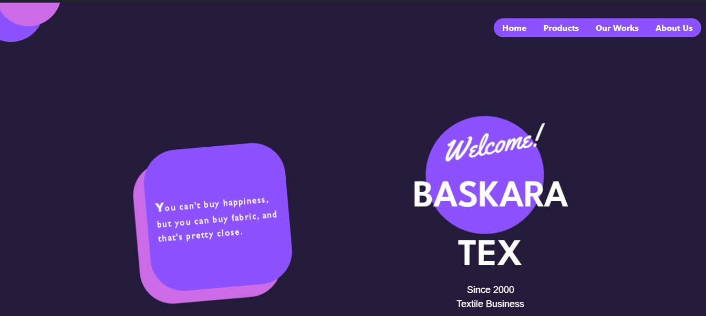
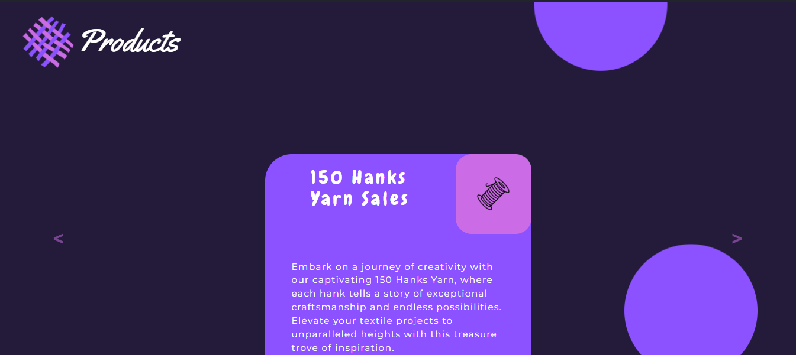
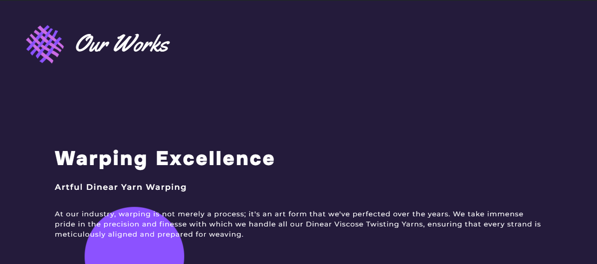
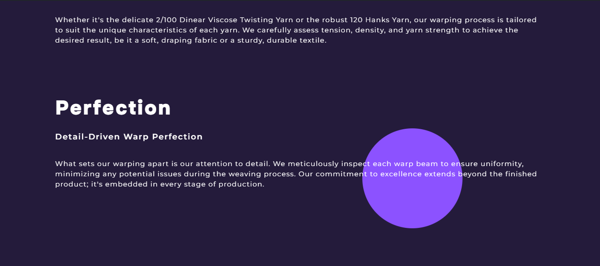
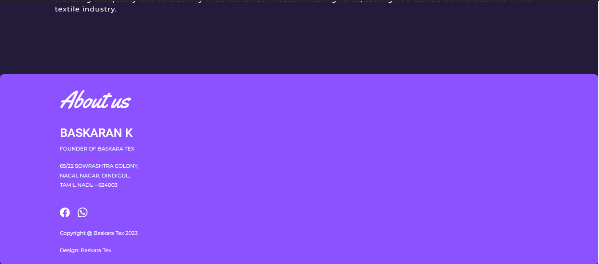

# Business Website 
## Client -- Baskara Tex 

## Description
- This project is completely build according to the client need, to promote their business. 
- Primary Goal of this project is to gain the work experience in real life projects using my skills.

## Features

- **Services** Display various services provided from the company
- **Products** Products was available for selling in the company was displayed
- **About** having the details to contact the company.

## Technologies Used
- **HTML** ( Structure of Website )
- **CSS** ( Design )
- **JAVASCRIPT** ( For Animation )
- **BOOTSTRAP** ( For Navbar )

## Getting Started

1. Clone the repository
   ```bash
   git clone https://github.com/25sudharsan27/baskaratex.git

2. Open Index.html file in the cloned repository

## Screenshots








